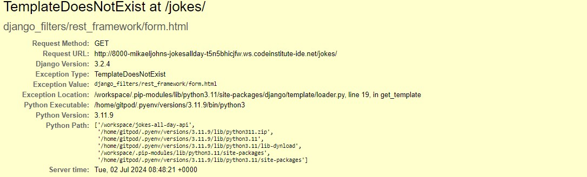

# Jokes All Day API
This is the Readme for the backend app to the Jokes All Day project.

[Live site](https://jokes-all-day-frontend-26d817bb989c.herokuapp.com)
[API site](https://jokes-all-day-0142d90d5482.herokuapp.com)
[Front end repository](https://github.com/mikael-johnsson/jokes-all-day)

## Database
This project is created with Django React Framework.

### Profiles
When a user creates an account, a profile is immediately created. It is connected to the Django User model by its Owner field.

### Jokes
Jokes is the most important model of the site. It is connected to Profiles through Author and can also have Ratings and Reports connected to it.

### Ratings
Ratings are created when a user rates another users joke. The rating itself is a FloatField and on the livesite it is given a value by clicking 1-5 stars. It is connected to Profiles by Author and Jokes by Joke.

### Reports
If a user dislikes a joke, they can report it. The report is conncted to Profiles through author and Jokes through Joke.

The Reports serializer has a to_representation function. It transforms the "personal_attack" report reason to "personal attack". As of now, it does not have a to_internal_data function which causes a bit of a problem when on the live site trying to edit a report with the reason "personal_attack". This is to be sorted in a later iteration.

### Followers
A profile can follow another profile, the instance Followers is then created. Followers is connected to Profiles through both Owner and followed.

## Testing
### Code Validation
This code is validated through [CI Python Linter](https://pep8ci.herokuapp.com/). It keeps the code up to PEP8 standard.
The files that has been validated are models, serializers, urls and views in the following apps:
- followers
- joke
- profiles
- rating
- report
- joke_main (main app)

**Error**
In one file, errors appeared. In joke_main's settings.py four of the lines were too long. Unfortunately, due to long file names, it was impossible to shorten the lines.

### Manual testing

#### URL testing

|URL|Expected result|Result|
|-|-|-|
|Root URl|Show welcome message|Pass|
|/profiles|Show list of profiles|Pass|
|/profiles/id|Show singular profile|Pass|
|/jokes|Show list of jokes|Fail|
|/jokes/id|Show singular joke|Pass|
|/ratings|Show list of ratings|Pass|
|/ratings/id|Show singular rating|Pass|
|/report|Show list of reports|Pass|
|/report/id|Show singular report|Pass|
|/followers|Show list of followers|Pass|
|/followers/id|Show singular follower|Pass|

*Read more about the failed test in [bugs](#bugs)*

#### CRUD testing
|Tested|Create|Read|Update|Delete|
|-|-|-|-|-|
|Profile|✔️|✔️|-|-|
|Joke|✔️|✔️|✔️|✔️|
|Rating|✔️|✔️|✔️|✔️|
|Report|✔️|✔️|✔️|✔️|
|Follower|✔️|✔️|-|✔️|

## Technologies Used
- Python
- Django Rest Framework
- CI Database
- Git
- GitHub
- Lucidchart
- Heroku

## Bugs
**AllAuth bug**
This app is created with Django version 3.11.9. For some reason, the app couldn't find the installed app AllAuth (used for User Authentification), and displayed the error message "No module name 'allauth'. 

The reason was that the workspace terminal continuously ran the "pyenv shell 3.12.2" command and that did not work with the AllAuth library.

The solution was (during the entire development), to run the following commands before migrating or running server:
- pyenv install 3.11.9
- pyenv local 3.11.9
- pyenv shell 3.11.9

Surely not the best solution, but it worked.

**Viewing jokes list in API View**
At the end of development, this bug appeared. Seemingly without any updates to code or interference with packages, it became impossible to view jokes in the list view. The code looks the same as other apps list view, but for some reason it does not show. The error message states "TemplateDoesNotExist".

In the frontend everything is working fine, therefor no further error handling is done at this point.

## Deployment
This application where deployed on Heroku. These are the steps to replicate the deployment:

1. Create account and log in to Heroku
2. Set Debug to False in settings.py
3. Create an app on Heroku
4. Create Config Vars based on you environment variables you have in you env.py file (secret key, database url etc.)
5. Ensure all migrations have been made
6. Ensure you code is pushed to GitHub
7. Connect you Heroku app to the GitHub repository
8. Deploy app from "Deploy" section > Manual Deploy 